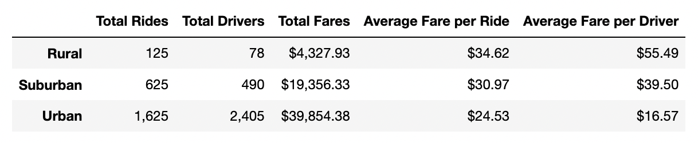
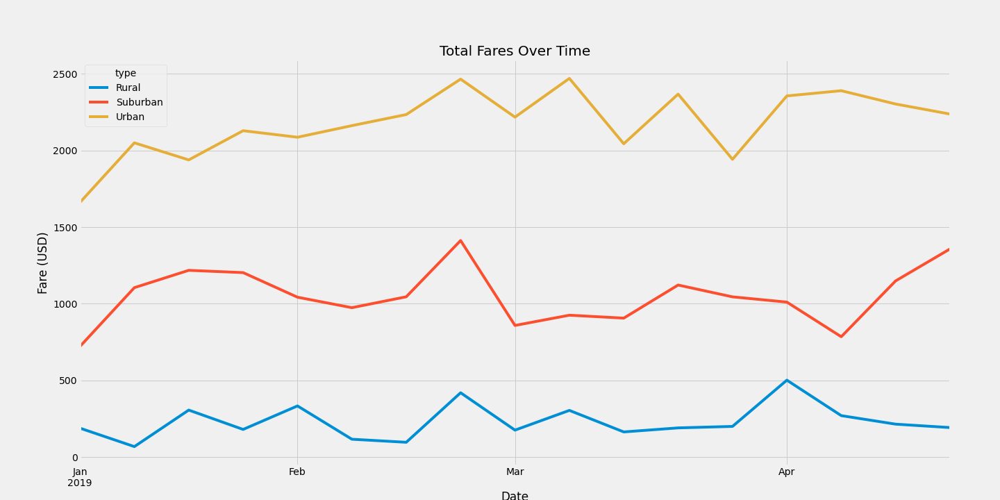

# PyBer Analysis

## Overview
The purpose of this challenge was to provide an analysis of Pyber fares for different city types (urban, suburban, and rural). The analysis provides a summary DataFrame displaying the totals (drivers, rides, and fares) and averages (fare per ride and fare per driver). Lastly, a line plot shows the changes in fares over time for each city type.

## Results

### Total Rides
The summary table shows that Urban cities have the most rides (1,625) followed by Suburban (625) and Rural (125).

### Total Drivers
The summary table shows that Urban cities have the most drivers (2,405) followed by Suburban (490) and Rural (78).

### Total Fares
The summary table shows that Urban cities made the most in fares at $39,854.38 followed by Suburban with $19,356.33 and Rural in last with $4,327.93.

### Average Fare per Ride
The summary table shows that the average fare per ride is the highest in Rural cities at $34.62. The average fare per ride is decreases in Suburban cities, $30.97, and is lowest in Urban cities at $24.53.

### Average Fare per Driver
The summary table shows that the average fare per ride is the highest in Rural cities at $55.49. The average fare per ride is decreases in Suburban cities, $39.50, and is lowest in Urban cities at $16.57.

### Total Fares Over Time

The **Total Fares Over Time** graph reinforces the findings above. Urban cities consistently have the most fares per week followed by Suburban and in last Rural cities. The longitudinal data does not show any specific trends with dates except for a consistent spike in late February.

## Summary
### Business Recommendations
1. Rural settings have the highest averages for both per ride and per driver. This makes sense given that there are the fewest drivers and the rides are most likely longer since rural settings tend to be more spread out. To increase the averages in Suburban and Urban settings it might help to put a cap on the number of drivers that are active in these settings. Big cities like New York and San Francisco tend to have more drivers than needed and the supply of drivers outpaces demand. I recommend analyzing the amount of drivers needed for each city to meet demand. This will ensure we have enough drivers to meet customer demand without having too many drivers sitting around.
2. The total number of rides and total fares are significantly lower in Suburban and Rural settings. I recommend we research the reasons keeping people from utilizing our services in these areas. Questions to investigate include:
- Is it the price? Average rural fares are the highest.
- Are wait times to long? These settings have the lowest drivers.
- Is it a lifestyle change? Suburan and Rural settings tend to have little public transportation making people less reliant on it.
- Is it access to technology? Cities tend to be early tech adopters.
3. Lastly the total drivers is significantly lower in Suburban and Rural settings. I recommend we research whether the drivers are meeting the demand in these settings. If not, we should analyze the reasons why more people do not become a driver for Pyber.
